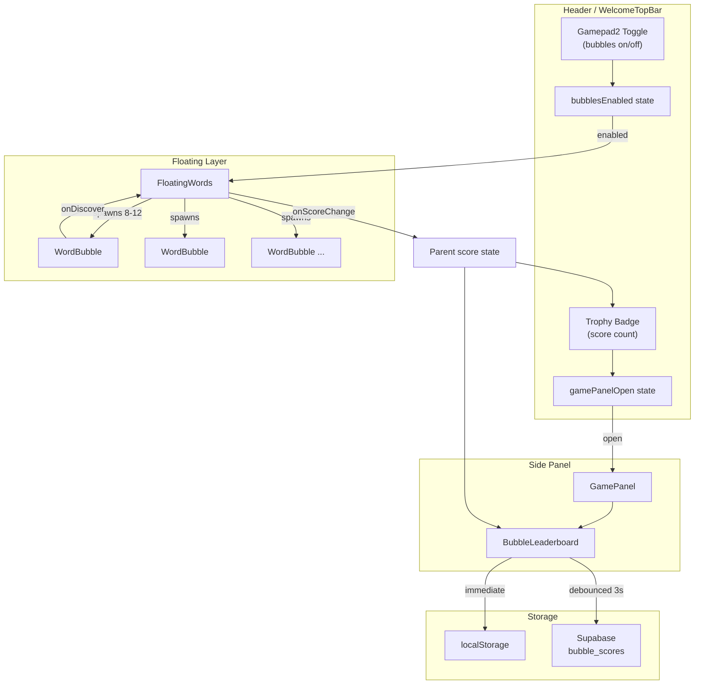
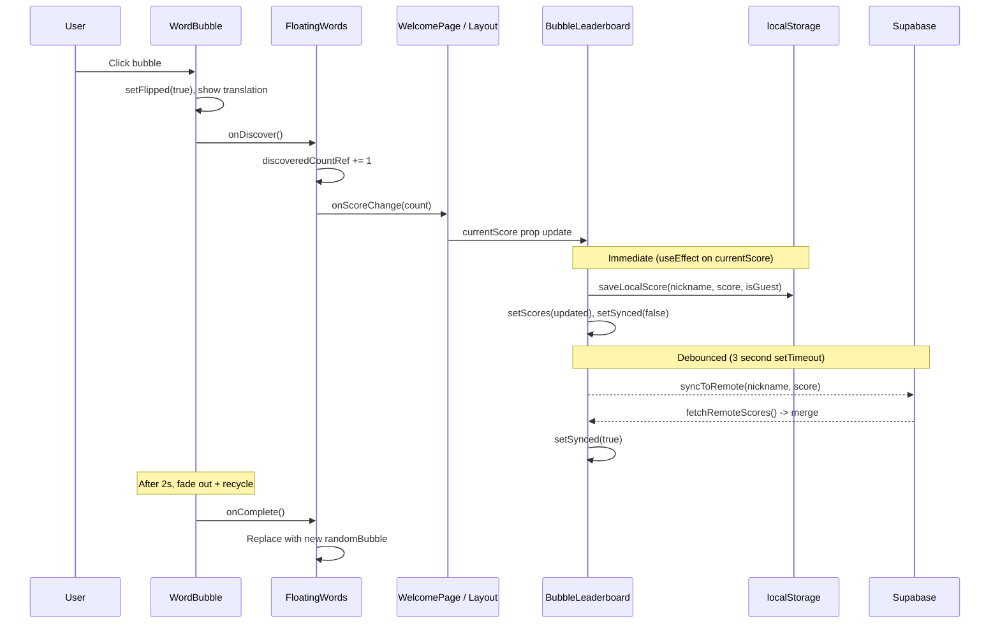

# DanskPrep Games

Documentation for the mini-game systems integrated into the DanskPrep learning app.

---

## Bubble Word Game

### Overview

The Bubble Word Game is an ambient vocabulary discovery mini-game. Semi-transparent Danish word bubbles float upward across the screen. Users click a bubble to "discover" it, which flips it to reveal the English translation and increments their score. The game runs as a background layer on the Welcome page (enabled by default) and can be toggled on/off from the Header in the main app (disabled by default in-app).

Scores are tracked per nickname on a leaderboard. localStorage serves as the primary persistence layer (immediate writes), with optional Supabase sync (debounced at 3 seconds) when the database is available.

### Component Hierarchy

```
WelcomePage / App (Layout)
  |
  +-- WelcomeTopBar / Header
  |     +-- Gamepad2 toggle (bubbles on/off)
  |     +-- Trophy badge (score display, opens GamePanel)
  |
  +-- FloatingWords
  |     +-- WordBubble (x8-12, auto-rising, click-to-discover)
  |
  +-- GamePanel (side panel, 384px wide, sticky)
        +-- BubbleLeaderboard
              +-- Nickname input + shuffle
              +-- Current score + sync status
              +-- Top 10 rankings table
```

**Key files:**

| File | Purpose |
|------|---------|
| `src/components/welcome/FloatingWords.tsx` | Manages bubble pool (spawn, recycle, stagger), reduced-motion fallback |
| `src/components/welcome/WordBubble.tsx` | Individual bubble: CSS animation (rise + sway), click flip, fade-out |
| `src/components/welcome/BubbleLeaderboard.tsx` | Leaderboard UI, localStorage CRUD, Supabase sync, nickname management |
| `src/components/welcome/GamePanel.tsx` | Side panel wrapper (Escape to close, slides in/out via width transition) |
| `src/components/welcome/WelcomeTopBar.tsx` | Welcome page nav bar with game toggle + trophy badge |
| `src/components/layout/Header.tsx` | Main app header with game toggle + trophy badge (in-app context) |
| `src/lib/bubble-names.ts` | Random nickname generator (`generateRandomNickname()`) |
| `src/index.css` | `@keyframes bubble-rise` and `bubble-fade-out` CSS animations |
| `supabase/migrations/006_add_bubble_leaderboard.sql` | `bubble_scores` + `bubble_nickname_history` tables |

### Architecture Diagram



### Score Flow (Data Flow Diagram)



### Auto-Sync Debounce Pattern

The leaderboard uses a two-tier persistence strategy to balance responsiveness with network efficiency:

1. **localStorage (immediate):** Every score increment triggers `saveLocalScore()` synchronously. The local leaderboard updates instantly, so the user always sees their current rank without delay.

2. **Supabase (debounced 3s):** A `setTimeout` fires 3 seconds after the last score change. If the user clicks another bubble within 3 seconds, the previous timer is cleared and a new one starts. This prevents flooding Supabase during rapid discovery streaks.

3. **Merge on fetch:** When remote scores arrive, they are merged with local scores by nickname (highest score wins per nickname), sorted descending, and capped at 10 entries. This handles the case where another device or user has a higher score in the remote database.

4. **Upsert pattern:** The remote sync checks for an existing row before inserting. For signed-in users, it matches on `user_id`; for guests, it matches on `nickname + is_guest=true`. This avoids duplicate rows from rapid or concurrent syncs.

### Guest vs Signed-In Modes

| Behavior | Guest | Signed-in |
|----------|-------|-----------|
| Nickname | Random, editable | Random, editable |
| Shuffle nickname | Resets score to 0 (new identity) | Keeps score, updates nickname (tracked in history) |
| Score accumulation | Per-nickname only | Per-user_id (single row, accumulates across nicknames) |
| Supabase unique constraint | `UNIQUE(nickname) WHERE is_guest = true` | `UNIQUE(user_id) WHERE user_id IS NOT NULL` |
| Nickname history | Not tracked | `bubble_nickname_history` table logs all changes |

**Guest shuffle rationale:** Since guests have no persistent identity, shuffling the nickname is equivalent to starting fresh. The old nickname's score remains on the leaderboard as a "ghost" entry. This encourages replaying.

**Signed-in accumulation:** A signed-in user has a single `bubble_scores` row keyed by `user_id`. Changing the nickname only updates the display name; the score carries over. The `bubble_nickname_history` table provides an audit trail of all names used.

### Database Schema

#### `bubble_scores` table

```sql
create table bubble_scores (
  id uuid primary key default gen_random_uuid(),
  user_id uuid references auth.users(id) on delete cascade,
  nickname text not null,
  score int not null default 0,
  is_guest boolean not null default true,
  created_at timestamptz default now(),
  updated_at timestamptz default now()
);

-- Conditional unique indexes (not standard unique constraints)
create unique index bubble_scores_user_unique on bubble_scores (user_id) where user_id is not null;
create unique index bubble_scores_guest_unique on bubble_scores (nickname) where is_guest = true;
```

RLS policies: public read, public insert, public update, delete restricted to owner (`auth.uid() = user_id`).

#### `bubble_nickname_history` table

```sql
create table bubble_nickname_history (
  id uuid primary key default gen_random_uuid(),
  user_id uuid not null references auth.users(id) on delete cascade,
  nickname text not null,
  created_at timestamptz default now()
);
```

RLS policies: read/insert restricted to own rows (`auth.uid() = user_id`).

### Bubble Animation Details

- **Rise:** CSS `@keyframes bubble-rise` moves bubbles from `bottom: -80px` to `bottom: 110%` with horizontal sway via `translateX(var(--sway))` oscillation. Duration: 12-22 seconds per bubble.
- **Stagger:** Initial bubbles are staggered by 1.5s each (delay parameter) to avoid all appearing simultaneously.
- **Fade-out on discover:** After a 2-second reveal (showing the English translation), the bubble plays `bubble-fade-out` (0.5s opacity to 0), then calls `onComplete()` to recycle.
- **Natural completion:** If a bubble reaches the top without being clicked, `onAnimationEnd` fires and the bubble is recycled with a new random word.
- **Reduced motion:** If `prefers-reduced-motion: reduce` is active, static scattered words are shown instead of animated bubbles.
- **Pool size:** 8 bubbles on mobile (<=640px), 12 on desktop. New bubbles spawn immediately when one exits.

---

## Future Game Ideas

The following mini-games could extend DanskPrep's gamification layer. Each targets specific grammar topics from the Module 2 curriculum and uses active recall / production over passive recognition.

### 1. Word Match

**Concept:** A timed matching game where Danish and English words are displayed in two columns (or scattered on screen). The player clicks or drags to connect matching pairs. Correct matches disappear; wrong matches flash red and incur a time penalty.

**Grammar focus:** Vocabulary breadth, noun gender awareness (showing "en/et" prefix helps reinforce gender), adjective comparative/superlative pairs (stor / stoerre / stoerst).

**Implementation sketch:**
- Grid of 8-12 cards (half Danish, half English), shuffled positions
- Click two cards to attempt a match; timer counts down from 60s
- Score = correct matches - wrong attempts; bonus for speed
- Pull word pairs from `words-pd3m2.json`

### 2. Sentence Builder

**Concept:** Jumbled Danish words fall slowly from the top of the screen (or appear in a word bank). The player arranges them into the correct sentence by clicking words in order. Validates against the V2 rule and correct clause structure.

**Grammar focus:** Omvendt ordstilling (inverted word order / V2 rule), hovedsaetning og ledsaetninger (main vs. subordinate clause word order), verb tense placement.

**Implementation sketch:**
- Sentence from `exercises-pd3m2.json` (type: `word_order`) provides the correct answer
- Words displayed as draggable tiles or click-to-place buttons
- Visual slot indicators show sentence structure (subject, verb, object zones)
- Streak multiplier for consecutive correct sentences

### 3. Speed Conjugation

**Concept:** A verb infinitive appears on screen with a target tense (e.g., "at spise" -> "datid"). The player types the correct conjugated form before a countdown timer expires. Correct answers extend the timer; wrong answers reduce it.

**Grammar focus:** Verber og tider (verb tenses: nutid, datid, foernutid, foerdatid, imperative). Directly targets the most error-prone area in Module 2 exams.

**Implementation sketch:**
- Pull verbs with complete inflections from `words-pd3m2.json` (277 words, filter to verbs with non-empty inflections)
- Random tense selection weighted toward weaker areas (track per-tense accuracy)
- Danish character input with virtual ae/oe/aa buttons
- Leaderboard: words per minute (WPM) or total correct in 60 seconds

### 4. Listening Bubbles

**Concept:** An audio clip plays a Danish word or short phrase. Multiple bubbles float on screen, each containing a different Danish word. The player clicks the bubble matching what they heard. Progressively harder: single words, then short phrases, then full sentences.

**Grammar focus:** Listening comprehension, phoneme discrimination (the notoriously difficult Danish vowel system), recognizing spoken forms of words already studied in vocabulary drills.

**Implementation sketch:**
- Requires audio files (TTS or scraped from SpeakSpeak listening exercises)
- 4-6 bubbles per round, one correct + plausible distractors (similar-sounding words)
- Score multiplier for streaks; lives system (3 mistakes = game over)
- Could reuse the existing `WordBubble` component with audio playback added
- Blocked on: audio content pipeline (SpeakSpeak scraper update or TTS integration)
